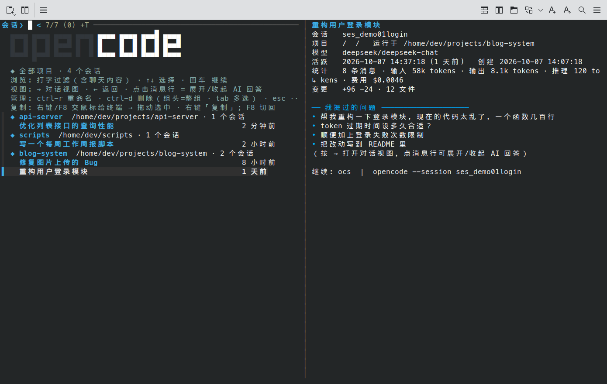
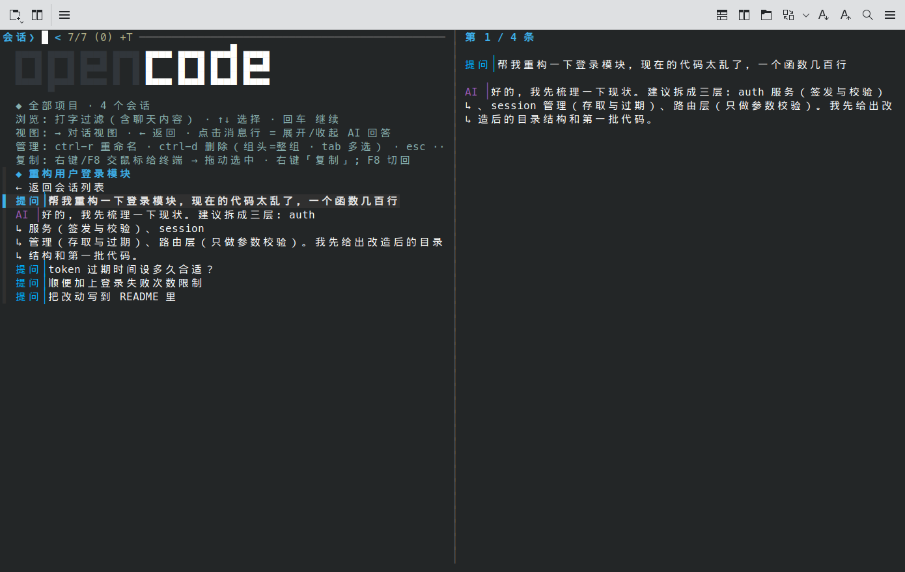

# ocs — opencode 会话选择器

> 像 ZCode 一样浏览、搜索、一键切回你的 opencode 历史会话。
> 单文件 Python 终端 TUI，直接读 opencode 的 SQLite，零第三方依赖。



## 为什么要它

opencode 很好用，但历史会话太难找：官方 `opencode session list` 只显示当前目录的会话，
只有 ID 和标题，想回到三天前某个项目里聊过的会话要靠翻记忆。ocs 把它变成 ZCode 那样的体验：

- **按项目分组**浏览全部历史会话，组内按时间倒序
- **模糊搜索**：不光搜标题，还能搜**会话里聊过的内容**（用中文关键词找英文标题的会话也没问题）
- **右侧实时预览**：会话详情 + 你提过的问题，光标一动就切换
- **对话视图**：只显示你的提问，点击某条提问才展开对应的 AI 回答，再点收起（见下图）
- **一键切回**：回车继续会话（自动切到会话目录），退出后回到列表接着选
- 会话管理：重命名、批量删除、分叉继续、`ctrl-y` 复制会话 ID



## 依赖

| 依赖 | 说明 |
|---|---|
| Python 3.8+ | 只用标准库，无 pip 依赖 |
| [fzf](https://github.com/junegunn/fzf) ≥ 0.44 | 交互界面（`execute`/`reload`/`--track` 等特性） |
| [opencode](https://github.com/sst/opencode) | 数据来源（需要已经用过它，存在 `~/.local/share/opencode/opencode.db`） |
| 终端 | 任何现代终端可用；**Konsole** 下鼠标与复制体验最完整（见下方说明） |

## 安装

```bash
git clone https://github.com/duruoxian/ocs.git
cd ocs
./install.sh          # 安装到 ~/.local/bin/ocs
```

或手动：

```bash
install -m 755 ocs ~/.local/bin/ocs   # 确保 ~/.local/bin 在 PATH 里
```

## 使用

```bash
ocs        # 打开会话列表（日常就用这一条）
ocs -h     # 查看完整帮助/教程
```

界面里的键位：

| 操作 | 效果 |
|---|---|
| 打字 | 过滤（可搜标题 + 会话内容全文） |
| `↑` `↓` | 选择，右侧实时预览 |
| `回车` / `双击` | 继续选中的会话，退出后自动回到列表 |
| `→` / `←` | 打开 / 退出「对话视图」（点击消息行展开/收起该条 AI 回答） |
| `ctrl-r` | 重命名会话 |
| `ctrl-d` | 删除（光标在分组行上=删整组；`tab` 多选后=批量删） |
| `ctrl-e` | 分叉继续（复制一份会话来聊） |
| `ctrl-y` | 复制会话 ID 到剪贴板 |
| `右键` / `F8` | 把鼠标交给终端（拖动选字、右键「复制」菜单），再按 `F8` 切回 |
| `esc` | 退出 |

命令行：

```bash
ocs -p /path/项目     # 只看指定项目
ocs --last [N]        # 不进列表，直接继续最近第 N 个会话
ocs --show ID         # 终端里查看详情（m:<会话ID>:<序号> 看单条消息）
ocs --delete ID...    # 删除会话（支持 id 前缀、多个，删除前确认）
ocs -l                # 纯文本列表（适合管道/脚本）
```

## 关于鼠标与复制（Konsole）

终端里鼠标同一时刻只能有一个"主人"：要么归程序（可以点击列表项），要么归终端
（可以拖动选字、右键弹复制菜单）。ocs 的做法是：

- **平时**鼠标归程序：箭头光标，单击选会话、双击进入；
- **要复制文字时**按一下 `右键`（或 `F8`），鼠标立刻交给终端——按住拖动就是选字、
  右键就是「复制」菜单，**都不需要按 Shift**；再按 `F8` 切回点击模式。

这个切换是用转义序列在运行时完成的（`?1000l/?1002l/?1006l`），fzf 无感知、界面不闪。
在其他终端里 `F8` 同样可用；若某个终端不支持右键传递，就用 `F8`。

## 实现小记

- **数据**：只读方式直连 `~/.local/share/opencode/opencode.db`（WAL），不改动 opencode 任何数据；
  重命名/删除走 opencode 官方 CLI 或单条 UPDATE。
- **界面**：单个 fzf 实例 + `execute`/`reload` 事件绑定，所有操作都在界面内完成，
  不闪回终端；`--track` 让光标在列表刷新后保持跟随。
- **颜色**：刻意只用蓝色/品红/灰（部分终端主题会把 cyan 渲染成刺眼的绿）。
- **开发验证**：所有交互（包括满屏鼠标点击、拖动选字、右键菜单）都在 Xvfb 隔离环境里
  用真实鼠标事件回归测试过。

## License

MIT
